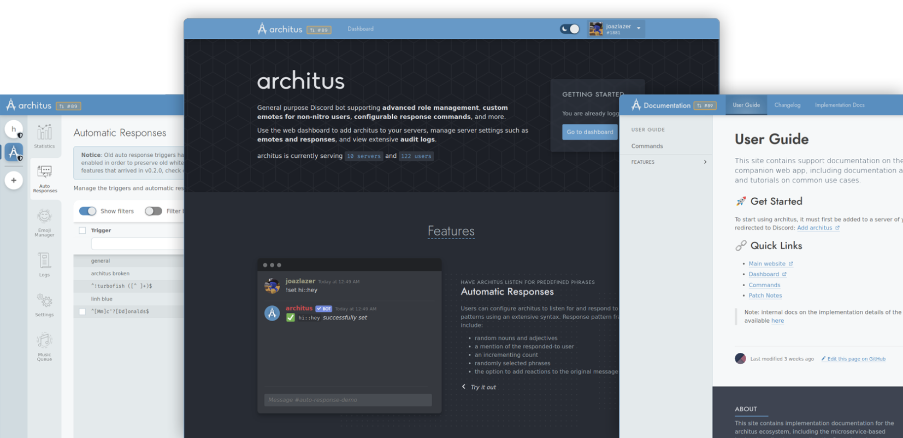

<h1><a href="https://archit.us/"></a></h1>

[](https://app.fossa.com/projects/git%2Bgithub.com%2Farchitus%2Farchit.us?ref=badge_shield) [](https://status.archit.us/) [](https://status.archit.us/) [](https://app.netlify.com/sites/architus/deploys)  [](https://discord.gg/FpyhED)

> Monorepo for all frontend source code under the Architus project. Archit.us provides a web dashboard server administrators and members can use to modify settings, view statistics and logs, and manage custom emoji and auto-responses. Docs.archit.us provides the platform to host a user guide, a changelog, and implementation documentation.

[](https://archit.us/app)

## 🚀 Getting Started

To use Archit.us to manage the Architus bot on installed servers or add it to new ones, [connect with Discord](https://api.archit.us/session/login) to be redirected to the web dashboard, where you can view settings and add the bot to your servers.

## 💁 Contributing

Architus is an open source project, and we welcome contributors. The monorepo is split into a set of [Yarn workspaces](https://classic.yarnpkg.com/en/docs/workspaces/)/[Lerna packages](https://lerna.js.org/), and contains the following packages:

- `@architus/app` - Main web dashboard codebase, built with React, Gatsby, TypeScript, and Linaria
- `@architus/docs` - Documentation site, built with React, Gatsby, TypeScript, and Linaria
- `@architus/lib` - Utility functions/types, built with TypeScript
- `@architus/facade` - Architus design system, including React components and design tokens to be consumed in downstream website projects via Linaria

### Setup

To start working on any of the above packages, you'll need to have [Node.js](https://nodejs.org/en/download/) installed. Once installed, run the following commands to download dependencies:

```console
npm install -g yarn
yarn install
```

## 📡 Development Server

Because both websites are built with [Gatsby](https://gatsbyjs.org) at their core, there are two options to preview the app while developing: a **hot reload-enabled development server** *(recommended)* and a **statically-generated site preview**.

### Hot-reload-enabled

At the repository root, run:

```console
yarn workspace @architus/<package> start
```

### Statically-generated preview

```console
yarn workspace @architus/<package> build
yarn workspace @architus/<package> serve
```

### Code Style

Each project uses [ESLint](https://eslint.org/) and [Prettier](https://prettier.io/) to enforce TypeScript code style across the repository, in addition to the TypeScript compiler. To run them locally, run:

```console
yarn lint
yarn typecheck
```

### Testing

Each package has testing configurations, based on [Jest](https://jestjs.io/), for use with creating unit tests and tracking coverage. To run all tests, run:

```console
yarn test
```

## ❓ Getting Help

If you have an issue about the bot, the web dashboard, or have any other questions, feel free to [create a new issue](https://github.com/architus/archit.us/issues/new) or [join our Discord server](https://discord.gg/FpyhED)

## 🛠 Tooling & Core Libraries

This project uses a variety of useful tooling to help develop, manage, and deploy the application. Among those are:

- [TypeScript](https://www.typescriptlang.org/) - Statically typed superset of JavaScript used to make code self-documenting and catch runtime errors early
- [Linaria](https://github.com/callstack/linaria) - Framework for using CSS-in-JS without a runtime overhead via static extraction
- [Gatsby](https://gatsbyjs.org) - Static site generator and data layer used to manage the build lifecycle of both the docs website and the web dashboard
- [Lerna](https://lerna.js.org/) - Monorepo management CLI used to automatically create symbolic links between dependent local packages, allowing developers to modify each locally
- [Yarn](https://yarnpkg.com/) - Package/dependency management tool
- [GitHub Actions](https://github.com/features/actions) - Used to automatically run CI/CD
- [Jest](https://jestjs.io/) - Used to run unit tests and track coverage via [Istanbul](https://istanbul.js.org/)
- [ESLint](https://eslint.org/) / [Prettier](https://prettier.io/) - Used to enforce consistent code style across the project & catch
- [Netlify](https://www.netlify.com/) - Used to automatically deploy the live and canary builds. Deploy information is available at [the Deploy page](https://app.netlify.com/sites/architus/deploys)
  - Production (`master`) is deployed at [archit.us](https://archit.us/)
  - Develop (`develop`) is deployed at [develop.archit.us](https://develop.archit.us/)
- [FOSSA](https://fossa.com/) - Used to scan dependencies and perform license compliance
- [UptimeRobot](uptimerobot.com) - Used to track uptime and notify upon outage for [the websites and the API](https://status.archit.us/)

## 📜 License

[](https://app.fossa.io/projects/git%2Bgithub.com%2Farchitus%2Farchit.us?ref=badge_large)
