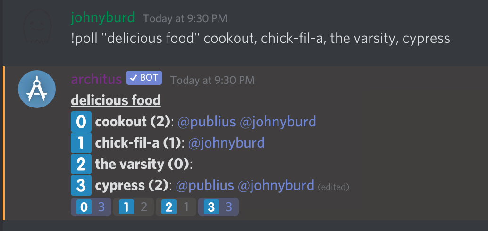

Scheduling events and voting made easy

## Commands
- [`schedule`](./#schedule): Start an event poll
- [`poll`](./#poll): Start a poll
- [`xpoll`](./#xpoll): Start an exclusive poll

## Schedule

### Usage
```
!schedule <title> <time>
```

This will start an event poll to see who can and cannot make it for an event. The poll will have
a title and the time formatted nicely along with response options of Yes, No, and Maybe.

## Poll

### Usage
```
!poll <"title"> <option 1>, [option 2], ..., [option n]
```

Putting the `title` in quotation marks is optional. However, if the title is not in quotations marks
then only a one word title will be created. If you want the title to containe multiple words, it must
be in quotation marks.

The options for the poll are comma separated words that come after the title. The poll options can be
as long or as short as you want as long as they are separated by commas.

<Alert type="info">

**NOTE:** This poll is not exlusive. Users will be able to vote for multiple options. See
[xpoll](/commands/events/#xpoll) for an exlusive version.

</Alert>

### Example


## XPoll

### Usage
```
!xpoll <"title"> <option 1>, [option2], ..., [option n]
```

XPoll has the same exact argument format as [poll](/commands/poll).

The only difference between poll and xpoll is that xpoll is exlusive. This means that a user can only
vote for a single option as opposed to multiple option. If someone votes for one option and then votes
for a second option, architus will automatically remove their vote for the first option.

### Example

