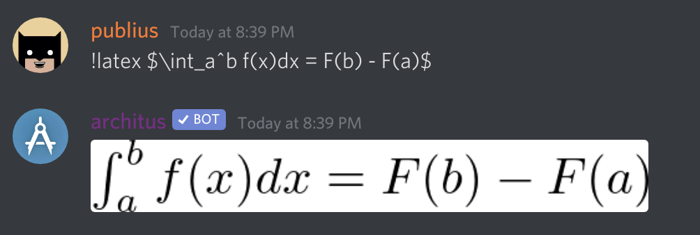

Compiles latex code to a nice image.

## Usage
`!latex <valid latex code>`

### Example

## General Usage
The command passes along whatever is after the command verbatim into a latex
file that is then compiled and converted to an image which is sent back to the channel. All of the
latex code is inserted into the body of a default latex file that you can see [below](/commands/latex/#environment).

The latex libraries [mathrsfs](https://www.ctan.org/pkg/mathrsfs) and [amsmath](https://www.ctan.org/pkg/amsmath?lang=en)
are included in the environment. This allows for some extra features that are very helpful for
writing various math expressions.

<Alert type="info">

**Note:** Remember to use `$` in your command to do equations. The `$`s will not be included automatically.

</Alert>

<Alert type="warning">

**Note:** Latex compile times are limited to 3 seconds. Try to ensure your code will compile within
that time limit to ensure architus can send back your compiled output.

</Alert>

## Environment

<Collapse>
    <ExternalSnippet
        src={"https://raw.githubusercontent.com/architus/architus/develop/shard/res/generate/"
             + "template.tex"}
        language="latex"
    />
</Collapse>

## Restrictions
Due to security and privacy concerns, some latex functionality has been disabled.

Disabled functionality includes:
- reading files
- writing files
- making new commands
- including packages
