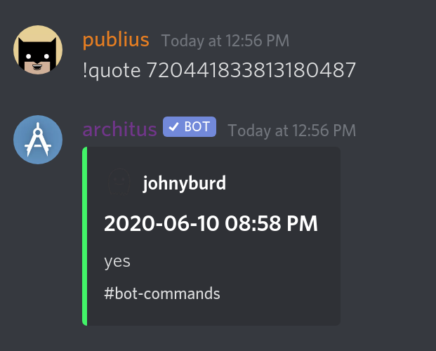

Quote a member's message all fancily.

## Usage
`!quote <url|id>`

A messages url can be found be right-clicking on the message. The message id can be found by following
the steps [here](https://support.discord.com/hc/en-us/articles/206346498-Where-can-I-find-my-User-Server-Message-ID-).

## Example

