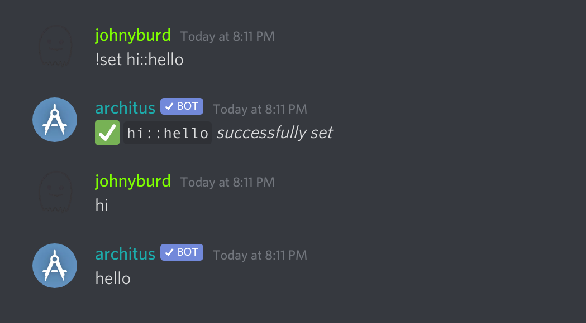
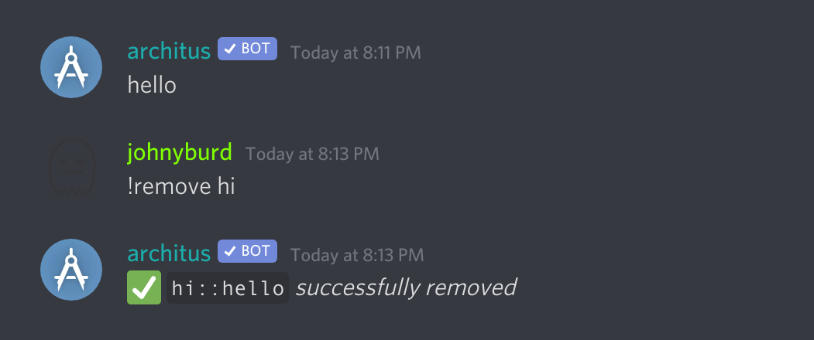
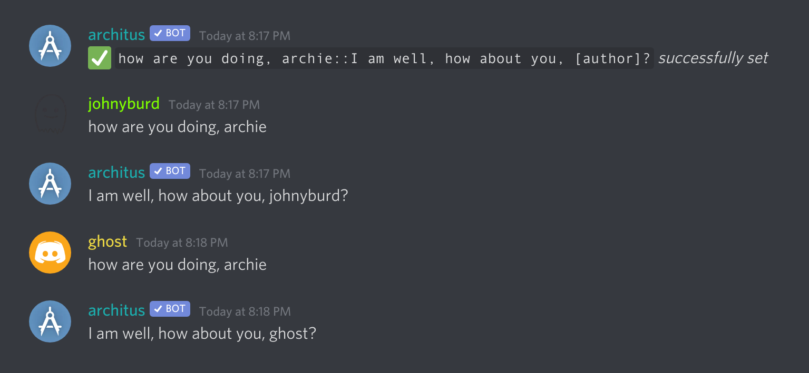
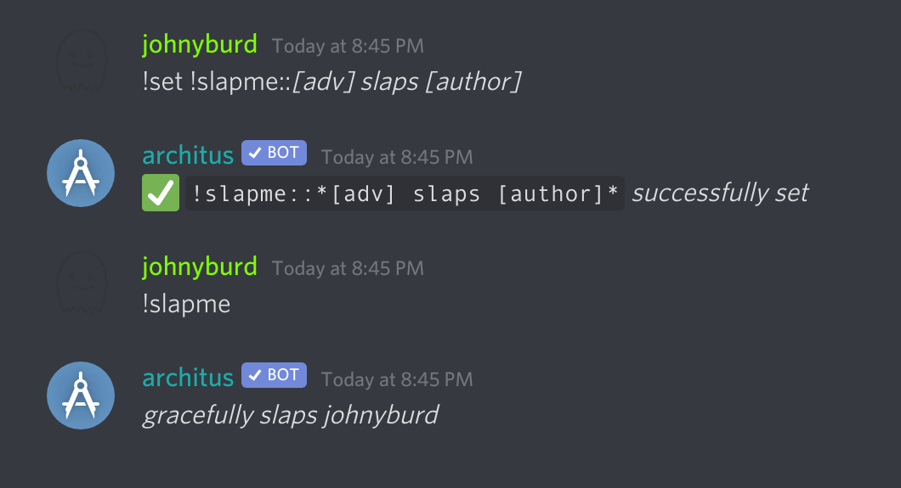
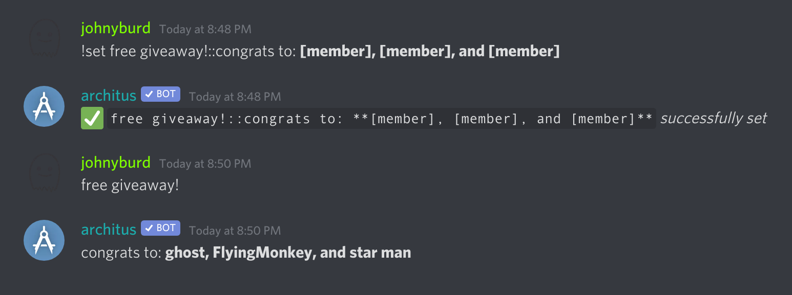
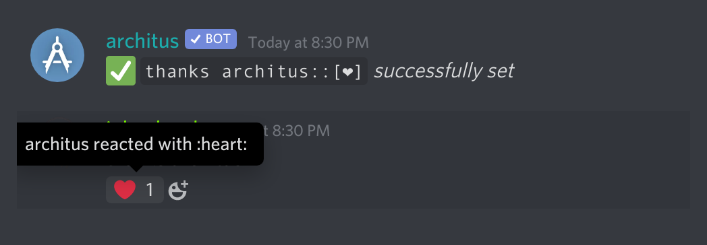
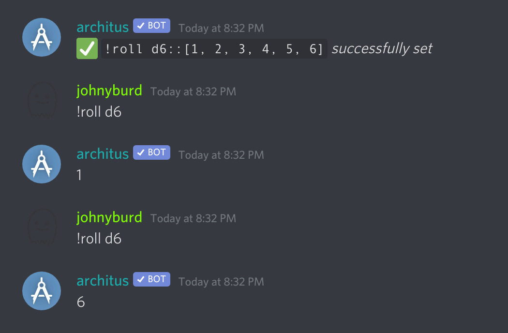
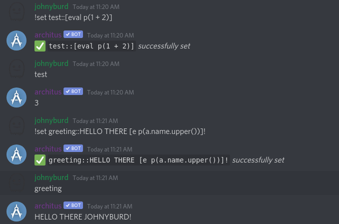
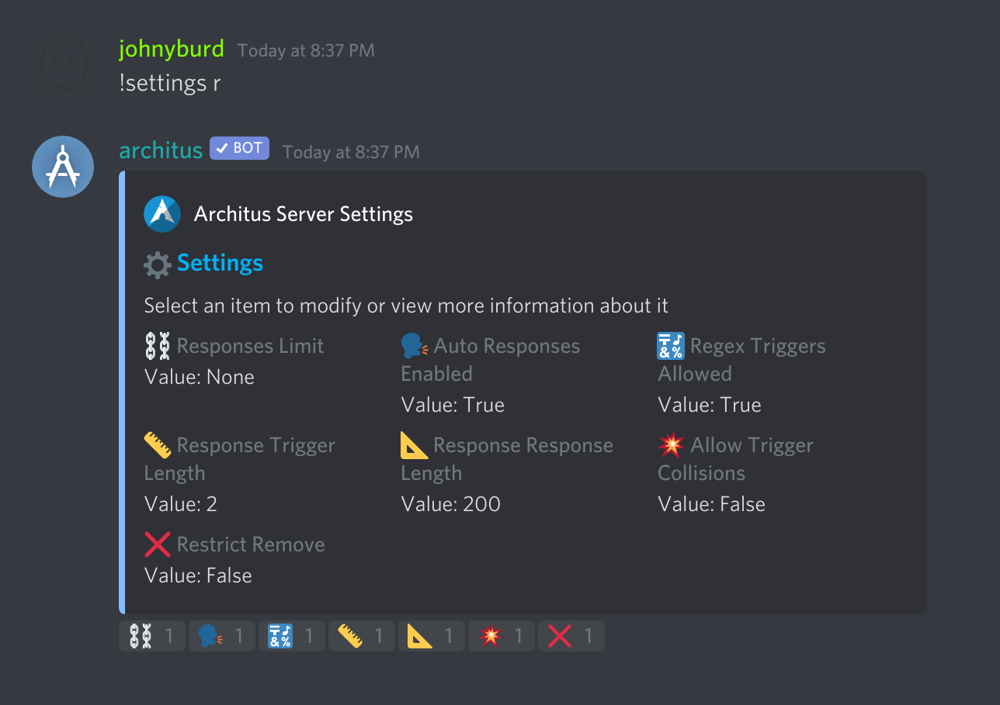

Auto responses allow users to configure architus to listen for and respond to message patterns using an extensive syntax explained below.

<Alert type="info">

**Note:** examples use the `!` command prefix but this may vary by server

</Alert>

## Setting Auto Responses

`!set <trigger>::<response>`

architus will respond with `<response>` when `<trigger>` is sent in a text channel.



## Removing Auto Responses

Auto responses may be removed from within the discord client via the `remove` command.

`!remove <trigger>`

The trigger must exactly match the original trigger used to set the auto response. If you are unsure of the original trigger, you may react with the [info reaction](/features/auto-responses/#info-reaction) on the response message to find it. Alternatively, the [web dashboard](https://archit.us/app) provides an interface for viewing and filtering auto responses in your servers.



## Info Reaction

As a way to mitigate potential confusion and annoyance stemming from the auto response system, architus provides a way to easily identify the source of automatically triggered messages: you may react with a 💬 (`:speech_balloon:`) to view the exact syntax and author of the auto response.


## Response Substitutions

responses set on architus may include any number of special tokens which will be substituted with a special value when the response is triggered.

#### \[author\]

substituted with the name of the user that triggered the auto response



#### \[noun\], \[adj\], and \[adv\]

substituted with a random noun, adjective, or adverb, respectively



#### \[count\]

substituted with the number of times the auto response has been triggered


#### \[member\]

substituted with the name of a random member of the server



#### \[:emoji:\]

not rendered in the response, but instead architus will react to the trigger message with the specified emoji



#### \[option 1, option 2, option 3\]

substituted with one of the options. The options are seperated by commas.



#### \[0\], \[1\], \[2\], ...

substituted with the [captured text](/features/auto-responses/#capture-groups) taken from the trigger message.


#### \[eval script\]

substituted with whatever is printed from the the starlark script that comes after the eval. Can also use `e` as a shorthand for `eval`.



See [here](/features/auto-responses/#eval) for more information on what can go into a script and how to write them.

### Errors

If architus is unable to parse your response, it will display an error along with the position of the character that confused it.

<Alert type="info">

**Tip:** If you are trying to use unmatched `[]`s, try escaping with a backslash `\`

</Alert>


## Trigger Punctuation & Whitespace

#### Punctuation

Basic text only triggers will not take punctuation into account. Triggers that include punctuation will take into account _only_ the punctuation characters used in the trigger.

For example, for the response `how are you::I'm good`, architus will respond `I'm good` to both `how are you` and `how are you?`.

Conversely, with `!roll d4::[1,2,3,4]`, architus will pick a number for `!roll d4` and _not_ for `roll d4`.

#### Whitespace

Whitespace in triggers is always matched literally. This differs from previous versions in which it was ignored.

<Alert type="info">

**Note:** for advanced handling of punctuation and whitespace, consider using [regex triggers](/features/auto-responses/#regex-triggers).
</Alert>

## Regex Triggers

Regexes or regular exressions are a standard language for matching patterns of strings. Regex triggers allow you to program architus to respond to patterns in messages rather than word-for-word phrases. They also allow capturing content from the trigger message to be used in the response.
<Alert type="info">

**Note:** Regex Triggers do not make any automatic adjustments to punctuation matching.
</Alert>

#### Setting a Regex Trigger

To set a regex trigger, ensure that your trigger begins with `^` and ends with `$`.

**e.g.** `!set ^test$::hi`

#### Common Syntax

Regular expressions are complex and the reader would be better served learning them elsewhere, but here is a short reference of common patterns that architus supports

###### Expressions

| Pattern  | Description                                    |
| -------- | ---------------------------------------------- |
| `.`      | matches any character                          |
| `[xyz]`  | matches `x`, `y`, or `z`                       |
| `[^xyz]` | matches any character except `x`, `y`, and `z` |
| `x`\|`y` | `x` or `y` (prefer `x`)                        |
| `x*`     | zero or more `x`, prefer more                  |
| `x+`     | one or more `x`, prefer more                   |
| `x?`     | zero or one `x`, prefer one                    |
| `x{n,m}` | `n` or `n+1` or ... or `m` `x`, prefer more    |
| `x{n,}`  | `n` or more `x`, prefer more                   |
| `x{n}`   | exactly `n` `x`                                |
| `(re)`   | numbered capturing group (submatch)            |
| `\d`     | digits (≡ `[0-9]`)                             |
| `\s`     | whitespace (≡ `[\t\n\f\r ]`)                   |
| `\w`     | word characters (≡ `[0-9A-Za-z_]`)             |

#### Capture Groups

When a trigger regex that contains capturing groups is matched, the captured content can be used in the response via the [response syntax](/features/auto-responses/#0-1-2-)

`!set ^should I (.+) or (.+)$::I think you should [[0], [1]]`

#### Wildcard (`*`)

Older users might be familiar with using `*` as a 'wildcard' to capture anything in the trigger. That syntax has been deprecated in favor of the much more powerful regex language. Below are a few examples of how one may accomplish the same things with the new system.

###### Comparison

| old                                       | new (exactly)                                 | new (better)                                            |
| ----------------------------------------- | --------------------------------------------- | ------------------------------------------------------- |
| `!set no*u::no no [capture]u`             | `!set ^no (.*)u$::no no [0]u`                 | `!set ^((no )+)u$::no [0]u`                             |
| `!set https://www.facebook.com/*::😂😂😂` | `!set ^https://www\.facebook\.com/.*::😂😂😂` | `!set ^https://(www\.)?facebook\.com/[\w/=?]+$::😂😂😂` |
| `!set !ban *::🔨 banned [capture] 🔨`     | `!set ^!ban (.*)$::🔨 banned [0] 🔨`          | `!set ^!ban (<@!\d+>)$::🔨 banned [0] 🔨`               |

<Alert type="info">

Generally speaking, if you are not interested in learning the intricacies of the regex system, replace the old `*` with `(.*)` and the old `[capture]` with `[0]`.
</Alert>

### Errors

In the event that architus is unable to parse your trigger regex, it will give an error message along with a number indicating the position (after the `^` and starting at 0) of the error.

<Alert type="danger">

Non-admin users will not be able to set regex triggers unless they are allowed in `settings`
</Alert>

## Eval
Architus uses the [starlark](https://github.com/bazelbuild/starlark) language as its scripting language for auto-responses. A detailed specification of everything you can do in the language can be found [here](https://github.com/bazelbuild/starlark/blob/master/spec.md).

Starlark is a stripped down dialect of Python. This means that most simple Python scripts will produce the exact same behavior in Starlark.

### Usage
Anything printed in the script will appear in the response content.

To print from starlark, the standard `print` function can be called. In addition, eval accepts a shorthand, `p`, to decrease the length of user scripts.

<Alert type="info">

Starlark has some peculiarities about it that make it more difficult to use when coming from Python. For example, strings are not iterable in Starlark, only lists. To iterate over a string you must call the `elems` method on it:

```py
print([a for a in "aoua".elems()])  # prints: ["a", "o", "u", "a"]
```

</Alert>

### Builtin Functions
The architus implementation of Starlark adds in a few extra builtins to improve user experience. They are called the same as any other Python builtin with the same behavior.

#### Random
The `random` function can be called with no arguments to return a random float in the range `[0,1)`:
```py
print(random())  # ex: 0.686645146372598
```

#### Randint
The `randint` function can be called with a high and low parameter to return a random integer in that range. For instance, `randint(lo, hi)` will return an integer in the range `[lo, hi)`.

#### Choice
The `choice` function will return a random element from a list. It accepts a single list element as an argument and its return type can be any of the types in the list:
```py
print(choice(["hello", 'a', 1, 1.2345, randint]))  # ex: hello
```

#### Sine
The `sin` function is the standard trigonometric sine function. It accepts radians as an argument and will return a float in the range `[0, 1]`.

#### Sum
The `sum` function will sum all of the elements in a list. The sum will always start at zero and all of the elements of the list must be a number:
```py
nums = range(1,101)
values = [1,1.5,3,4.5]
assert(sum(nums) == 5050)
assert(sum(values) == 10.0)
```

#### Get
The `get` function acts as an HTTP get request. It requires a url as a parameter and can optionally take a dict of headers.

```py
resp = get("https://my-api.host.com/endpoint", headers={"my-header": "my-data"})
```

#### Post
The `post` function acts as an HTTP post request. It requires a url as a parameter and can optionally take a dict of headers, a dict of json data, or raw data as keyword parameters. The keywords are "headers", "json", and "data" respectively.

<Alert type="info">

Only one of the json or headers keyword parameters can be used at a time. If they are both passed to the function, json will take priority and data will be ignored.

</Alert>

```py
resp = post("https://api.archit.us/guild-count", headers={"custom-header": "value"}, json={"data": 1234})
```

### Global Variables
Architus adds several global variables to the script environment to allow users to access information about the message, author, and channel that triggered the auto-response:

* [message (msg)](#message)
* [author (a)](#author-1)
* [channel (ch)](#channel)
* [count](#count)
* [caps](#caps)

Some global variables are objects. To access the `name` member of an `author` you can just use `author.name`.

###### message

| Member name   | Type      | Description                  |
| ------------- | --------- | ---------------------------- |
| id            | integer   | Discord id of the message    |
| content       | string    | Raw content of the message   |
| clean         | string    | Clean content of the message |

###### author

| Member name   | Type              | Description                                               |
| ------------- | ----------------- | --------------------------------------------------------- |
| id            | integer           | Discord id of author                                      |
| avatar\_url   | string            | Url for author's avatar                                   |
| color         | string            | The color the author's name is displayed as               |
| discrim       | integer           | The discriminator part of the author's username           |
| roles         | list of integers  | Contains the discord ids for each role the author is in   |
| name          | string            | Author's username with no discriminator                   |
| nick          | string            | Author's nickname in the server                           |
| disp          | string            | Author's display name in the server                       |

###### channel

| Member name   | Type              | Description                   |
| ------------- | ----------------- | ----------------------------- |
| id            | integer           | Discord id of the channel     |
| name          | string            | Name of the channel           |

##### count
The number of times this auto response has been triggered.

##### caps
An array of strings that contain all of the capture groups defined in the [regular expression trigger](#regex-triggers) of the auto response.


## Settings

The auto response settings pane can be accessed by the `settings responses` command



###### Options
| name | type | description |
| ---- | ---- | ----------- |
| Responses Limit | int? | the number of responses that each user can have set in the server |
| Auto Responses Enabled | bool | prevents setting new responses or triggering existing ones |
| Regex Triggers Allowed | bool | whether triggers that use regexes may be set |
| Response Trigger Length | int | the minimum length of triggers that users may set |
| Response Response Length | int | the maximum length of responses that users may set |
| Allow Trigger Collisions | bool | whether setting triggers that overshaddow each other is allowed |
| Restrict Remove | bool | whether anyone may remove an auto response or just the author |
| Allow Embeds | bool | If false, architus will escape links in an auto response to prevent discord from embedding them |
| Allow Newlines | bool | Toggles whether or not architus will strip new lines in auto response outputs |

<Alert type="info">

**Note:** most of these restrictions do not apply to admininstrators

</Alert>
