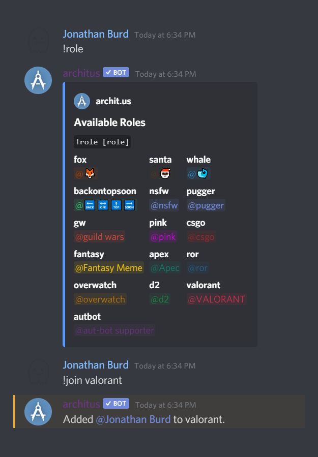

The role manager allows members to assign themselves to a configurable subset of roles in addition to supporting a default role.

## Role
### Usage
`!role [role]` - lists available roles or joins/leaves them

## Joining Roles

Simply use `!roles` to list each joinable role. Use the name above each role to join.

### Example

## Leaving Roles

Re-run `role` with the same role as before to remove it.

### Example

