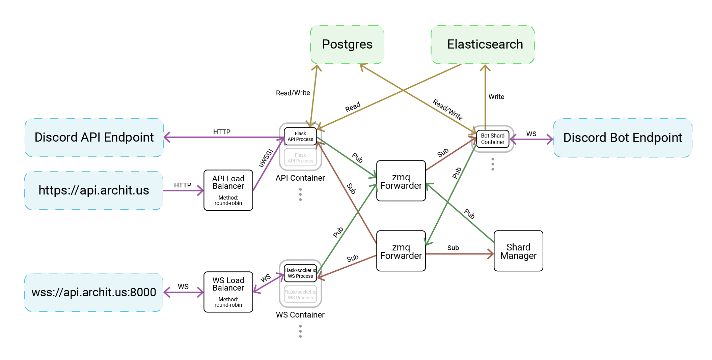

The [architus backend](https://github.com/architus/architus) is built with microservices at its root, allowing for rapid and flexible horizontal scalability. When it comes to the Discord API, the bot takes advantage of Discord's [sharding functionality](https://discordapp.com/developers/docs/topics/gateway#sharding), which provides determinate distribution of guilds across each bot instance.

## Network Diagram

