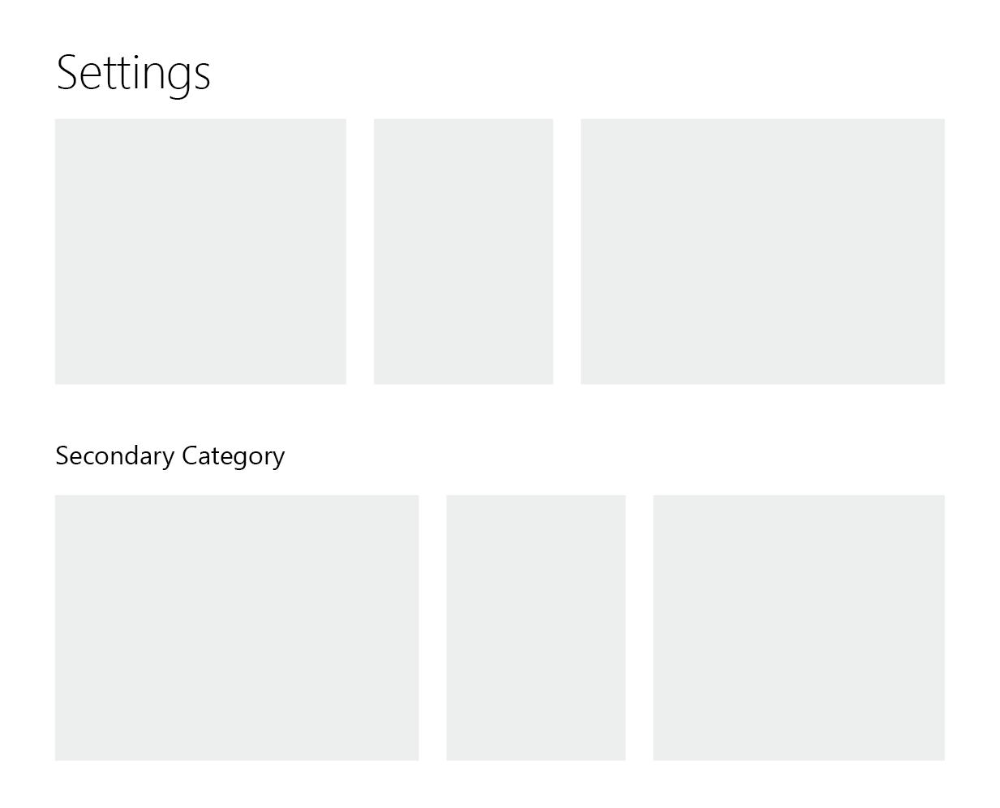

The Settings tab is the place for server administrators to configure the way Architus interacts with their server, allowing them to set specific limits/assignments/etc. for various modules of the bot. To make this possible, settings are dynamically rendered, consumed, and validated based off of a JSON schema as detailed below.

## Get Guild Settings

<Route method="GET" path="/settings/{guild_id}" auth />

Gets the settings schema data for the current server.

## Top-level format

At the highest level, the Settings schema is composed of an array of category definitions, each of which contain one or more settings cards:

```json
{
  "categories": [
    ...
  ]
}
```

The reasoning behind having a top-level organization scheme of the `category` is to support a view that looks something like the following mockup, where multiple vertical sections would be possible, enabling large collections of settings
to be effectively categorized.



### Category Object

###### Category Structure

| Field  | Type                                          | Description                                                                   |
| ------ | --------------------------------------------- | ----------------------------------------------------------------------------- |
| title? | string                                        | if non-null, then this category will appear separate from the global category |
| cards  | array of [setting card](#card-object) objects | child cards within the category                                               |

Each card is configured individually, representing a collection of individual settings that fall under a given topic.

### Card Object

###### Card Structure

| Field    | Type                                        | Description                                                                          |
| -------- | ------------------------------------------- | ------------------------------------------------------------------------------------ |
| title    | string                                      | title string that appears at the top of the card once rendered                       |
| settings | array of [setting](#setting-object) objects | individual settings fields that are listed once rendered, ordered from top to bottom |
| width?   | integer                                     | relative width of the card, must be in the interval [1, 10]                          |

##### Card Example

```json
{
  "title": "Gulag",
  "width": 5,
  "settings": [
    {
      "id": "gulag_command",
      "label": "Command",
      "input_type": "string",
      "default": "gulag"
    },
    ...
  ]
}
```

## Settings

In order to be consumed on both the backend and the frontend, each Setting object contains a variety of information related to each setting entry.

### Setting Object

###### Setting Structure

| Field             | Type                                                             | Description                                                                                                                                                                                                                                                 |
| ----------------- | ---------------------------------------------------------------- | ----------------------------------------------------------------------------------------------------------------------------------------------------------------------------------------------------------------------------------------------------------- |
| id               | string                                                           | internal **unique** (among all settings) key used to access the setting across the application                                                                                                                                                                                   |
| label             | string                                                           | display text shown to the left of each setting _(Fewer than 25 characters)_                                                                                                                                                                                 |
| input_type        | string enum                                                      | type of input component used on the frontend. One of `["string", "numeric", "string_auto_complete", "string_highlighted", "switch", "string_array_auto_complete"]`                                                                                                 |
| default           | any                                                              | initial value of the setting used for newly initialized guilds                                                                                                                                                                                              |
| value             | any                                                              | current value of the setting                                                                                                                                                                                                                                |
| help_tooltip?     | string                                                           | text content of an optional [HelpTooltip](https://storybook.archit.us/?path=/story/helptooltip--basic) component                                                                                                                                            |
| properties?       | object                                                           | key-value pairs passed as props to the input component                                                                                                                                                                                                      |
| validation_steps? | array of Union<string, [validation](#validation-object) objects> | chain of validation steps necessary for the setting value to pass, ran on both the frontend and backend, unless otherwise specified (see [object information](#validation-object)). If a string, then the value represents the `key` of the individual step |
| cli?              | [cli object](#cli-object)                                        | if non-null, then includes the individual setting in the list of settings that can be edited in the Discord client using the `!settings`/`?settings` command                                                                                                |
#### Values

The values for each field are stored in a separate object, which is a flat dictionary mapping entry IDs to their corresponding value.  This allows the client or server to update the values of the settings without resending the entire schema.

##### Setting Example

```json
{
  "id": "starboard_threshold",
  "label": "Starboard Threshold",
  "input_type": "numeric",
  "default": 5,
  "value": 6,
  "properties": {
    "min": 0,
    "integer": true
  },
  "validation_steps": [
    "isNumber",
    "isInteger",
    { "key": "isInRange", "min": 0 }
  ],
  "cli": {
    "name": "Starboard Threshold",
    "emoji": "⭐",
    "message": "⭐ This is the number of reacts a message...",
    "input_mode": "replace"
  }
}
```

### Validation Object

Validating the data is important on both the backend (for data safeguarding) and the frontend (for UX), so a processing chain model is used to allow for symmetry in validation logic. Each validation entry can either be a simple `string`, in which case this value represents the same thing as its expanded object form. For example, `"isArray"` is equivalent to:

```json
{
  "key": "isArray"
}
```

###### Validation Structure

| Field    | Type   | Description                                                                |
| -------- | ------ | -------------------------------------------------------------------------- |
| key      | string | dictionary key used to access function definitions when consumed           |
| ...rest? | object | additional _named_ (unordered) arguments passed to the validation function |

##### Validation Example

```json
{
  "key": "any",
  "of": [
    [
      {
        "key": "matchesRegex",
        "regex": "^$"
      }
    ],
    [
      {
        "key": "matchesRegex",
        "regex": "(?:^@.+$)|^(?:^[0-9]{7,20}$)"
      },
      "isRole"
    ]
  ]
}
```

#### Common Validation Functions

- `any(current: any, { of: Array<Array<ValidationObject>> })`
  - Passes if any of the validation chains in the `of` array pass, starting from index `0`. Note that not all validation chains may be called if an earlier one passes
- `matchesRegex(current: string, { regex: String })`
  - Passes if the current value tests positively to the given regex (only will work with `string`s)
- `isInRange(current: number, { min?: Number, max?: Number })`
  - Passes if the current value is greater than the minimum (if specified), and less than the maximum (if specified)
- `isArray(current: any)`
  - Passes if the current value is an array type (note: a serialized array string won't be parsed)
- `isBoolean(current: any)`
  - Passes if the current value is a boolean type (note: a serialized boolean string won't be parsed)
- `isNumber(current: any)`
  - Passes if the current value is a float/integer/number type (note: a serialized float string won't be parsed)
- `isInteger(current: number)`
  - Passes if the current value has no decimal segment (whether the type is a true integer or not)
- `allPass(current: array<any>, { steps: array<ValidationObject> })`
  - Passes if each element in the current value array passes the specified validation chain (as individual elements)

#### Discord-specific Validation Functions

Each of the following functions works with Discord entities, and examines whether they exist in the context of the current guild. The objects can be resolved by either their [snowflake ID](https://discordapp.com/developers/docs/reference#snowflakes) or their serialized forms _(see below)_

- `isRole(current: string)`
  - Serialized form: `@{name}`
- `isUser(current: string)`
  - Serialized form: `@{username}`
- `isChannel(current: string)`
  - Serialized form: `#{name}`
- `isEmoji(current: string)`
  - Serialized form: `:{shortcode}:` or `{unicode_emoji}`

### CLI Object

###### CLI Structure

| Field      | Type                 | Description                                                                                             |
| ---------- | -------------------- | ------------------------------------------------------------------------------------------------------- |
| name       | string               | name of the setting as displayed in the CLI menu embed                                                  |
| emoji      | unicode emoji string | reaction emoji used to select this setting in the CLI menu embed (also appears to the left of the name) |
| message    | string               | prompt string displayed in edit mode                                                                    |
| input_mode | string enum          | type of method used to update the value from the CLI. One of `["replace", "array_toggle"]`              |

## Example Schema

<Alert type="warning">

Note that this is out of date

</Alert>
<Collapse unwrap>

`embed:internal/modules/settings/example-schema.json`

</Collapse>
